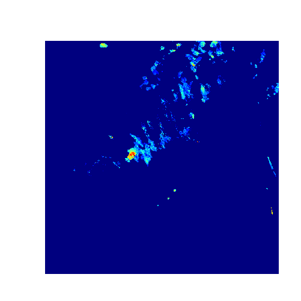

Requirement :

`python-opencv`

`matplotlib`

`argparse`

`os`

## video2img

This is a python script converting the video into image`

### Argument:

--video is the output video file, take care of directory
--image is the image directory
--frame is the frame output, 

For example:

* frame=1 every frame in video

* frame=2 every two frame provide one image

### Working

```bash
python video2img.py --video VIDEO_PATH --image IMAGE_PATH --frame NUM
```

or just using default setting by Hale

```bash
python video2img.py 
```

prepare your own image in `Image` or Video in `Video`

## image2video

a python script converting the image into video

### Arguments:

--video is the output video file, take care of directory

--image is the image directory

--fps is the output frame per seconds (default is 12)

* Notice: the count is %03d%  for the sake of Hale's data (0=_=0)

### Working

```bash
python image2video.py --video PATH_VIDEO --image PATH_IMAGE --fps FPS
```

or just using default setting by Hale

```bash
python video2img.py 
```

prepare your own image in `Image` or Video in `Video`

## ICDM_data_preprocessing

video2image
Author: Hale Qiu

Read the raw data in ICDM competition

### Arguments

* Convert to jet thermodynamic diagram

* Clean the blank like:255

* reshape the value from 0-80 into 0-255

  * Argument:

  --output is the image directory for output
  --image is the image directory

Notice: the count is %03d%  for the sake of Hale's data (0=_=0)

### Working

```bash
python image2video.py --output PATH_OUTPUT --image PATH_IMAGE
```

* Notice：

PATH_IMAGE is the directory of images like:
`RAD_206482414212530`

### Output:

Remove the axis



## xml2csv

This file is working in object_detection

## TFfor

script for TFrecord
